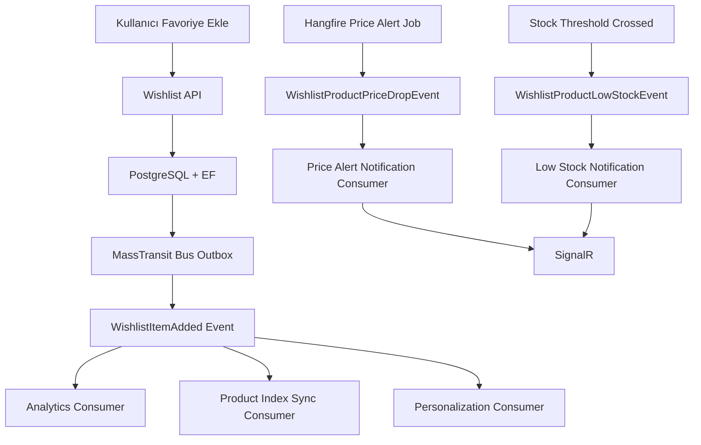

# Wishlist Feature Status

Bu doküman wishlist özelliğinin mevcut ürün, mimari ve observability durumunu özetler.

## Stack

- .NET 8
- Clean Architecture
- EF Core
- PostgreSQL
- Redis
- Elasticsearch
- RabbitMQ
- MassTransit
- Hangfire
- SignalR
- React
- RTK Query
- Autofac

## Uygulama Durumu

### Bölüm 1: Edge Case'ler

Tamamlandı.

- `AddedAt` ve `AddedAtPrice` snapshot alanları aktif
- duplicate add akışı idempotent
- 500 ürün limiti aktif
- guest wishlist ve login sonrası sync aktif
- pasif ürünler unavailable state ile gösteriliyor

### Bölüm 2: Mimari

Tamamlandı.

- wishlist event'leri MassTransit üzerinden publish ediliyor
- native EF outbox / bus outbox kullanılıyor
- analytics consumer, search index sync consumer ve personalization consumer aktif
- inbox dedupe ile consumer idempotency korunuyor

### Bölüm 3: Güvenlik

Tamamlandı.

- Redis tabanlı merkezi rate limiting aktif
- wishlist mutasyonları kullanıcı scope'unda çalışıyor
- audit log kayıtları mevcut
- request validation kuralları tamamlandı

### Bölüm 4: Performans

Tamamlandı.

- `WishlistCount` denormalize alanı aktif
- cursor bazlı pagination aktif
- Elasticsearch `wishlistCount` alanı index'te tutuluyor
- RTK Query invalidation wishlist ve product cache'leri için granüler hale getirildi

### Bölüm 5: Ürün Özellikleri

Tamamlandı.

- fiyat alarmı
- paylaşılabilir wishlist
- düşük stok bildirimi
- en çok favorilenenler widget'ı
- tümünü sepete ekle
- koleksiyonlar / çoklu listeler

### Bölüm 6: Kibana Analytics

Kod tarafı tamamlandı.

Structured analytics log'ları aşağıdaki akışlar için üretilebiliyor:

- `WishlistItemAddedEvent`
- `WishlistItemRemovedEvent`
- `WishlistItemAddedToCart`
- `WishlistItemAddToCartSkipped`
- `WishlistBulkAddToCartCompleted`
- `WishlistPriceAlertTriggered`
- `WishlistPriceAlertDelivered`
- `WishlistLowStockDelivered`
- `WishlistLowStockSkipped`

## Mimari Akış

## Kibana Dashboard Alanları

Wishlist odaklı dashboard'lar için en kritik alanlar:

- `AnalyticsStream`
- `AnalyticsEvent`
- `FunnelStage`
- `NotificationChannel`
- `UserId`
- `WishlistId`
- `ProductId`
- `ProductName`
- `Category`
- `PriceAtTime`
- `Currency`
- `WishlistCount`
- `RequestedCount`
- `AddedCount`
- `SkippedCount`
- `Reason`
- `TargetPrice`
- `OldPrice`
- `NewPrice`
- `StockQuantity`
- `Threshold`
- `OccurredAt`
- `MessageId`

## Önerilen Kibana Panelleri

### 1. Saatlik Favori Ekleme Trendi

- filtre: `AnalyticsEvent: WishlistItemAddedEvent`
- görselleştirme: date histogram
- kırılım: `Category`

### 2. Favoriden Sepete Dönüşüm

- event'ler:
  - `WishlistItemAddedEvent`
  - `WishlistItemAddedToCart`
  - `WishlistBulkAddToCartCompleted`
- metrikler:
  - toplam favori ekleme
  - favoriden sepete geçen ürün sayısı
  - toplu sepete ekleme başarı oranı

### 3. Fiyat Alarmı Etkinliği

- event'ler:
  - `WishlistPriceAlertTriggered`
  - `WishlistPriceAlertDelivered`
- metrikler:
  - tetiklenen alarm sayısı
  - delivered oranı
  - kategori bazlı alarm dağılımı

### 4. Düşük Stok Aciliyet Paneli

- event'ler:
  - `WishlistLowStockDelivered`
  - `WishlistLowStockSkipped`
- metrikler:
  - bildirime düşen ürün sayısı
  - kullanıcıya ulaşan bildirim adedi
  - `Threshold` altındaki ürün yoğunluğu

### 5. En Çok Favorilenen Ama Satın Almaya Dönmeyen Ürünler

- `WishlistItemAddedEvent` ile yoğun favori alan ürünleri bulun
- `WishlistItemAddedToCart` hacmi düşük olanları filtreleyin
- kategori ve fiyat bandı kırılımı ekleyin

## Operasyonel Sonraki Adımlar

Kod tarafı tamamlandıktan sonra operasyonel olarak şu işler önerilir:

1. Kibana'da saved search ve dashboard'ları oluşturmak
2. `AnalyticsStream = Wishlist` filtresiyle temel görünümü sabitlemek
3. fiyat alarmı ve düşük stok event'leri için alert threshold tanımlamak
4. favoriden sepete dönüşüm oranını haftalık rapora bağlamak
